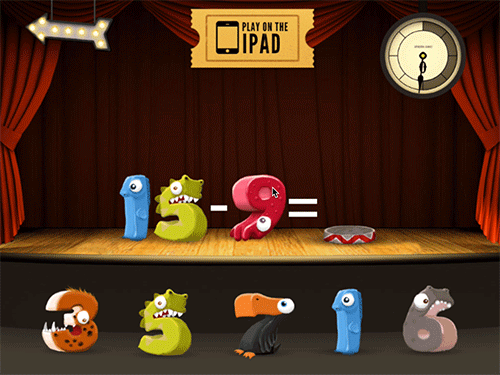
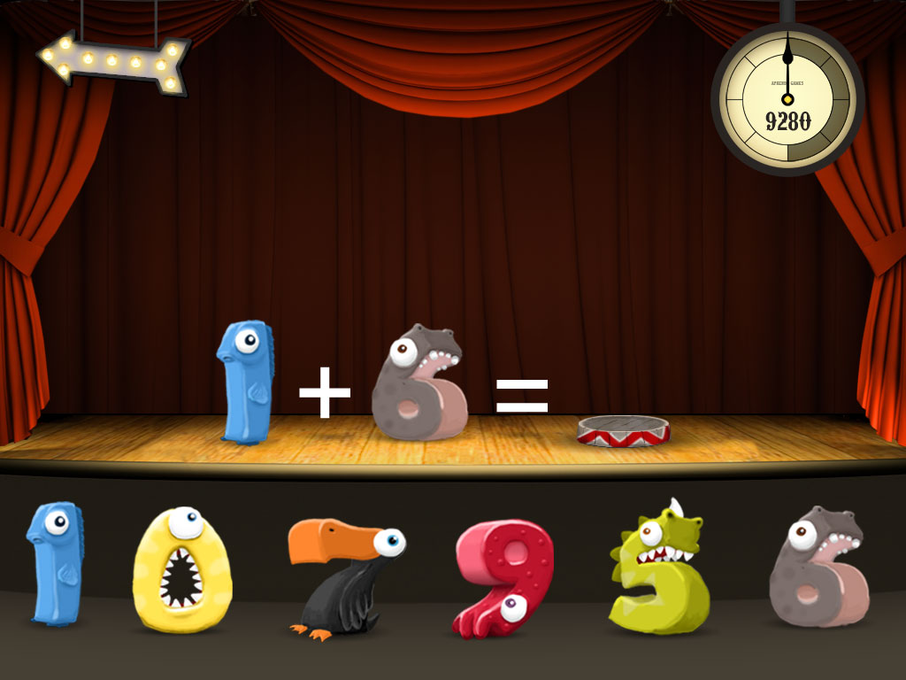
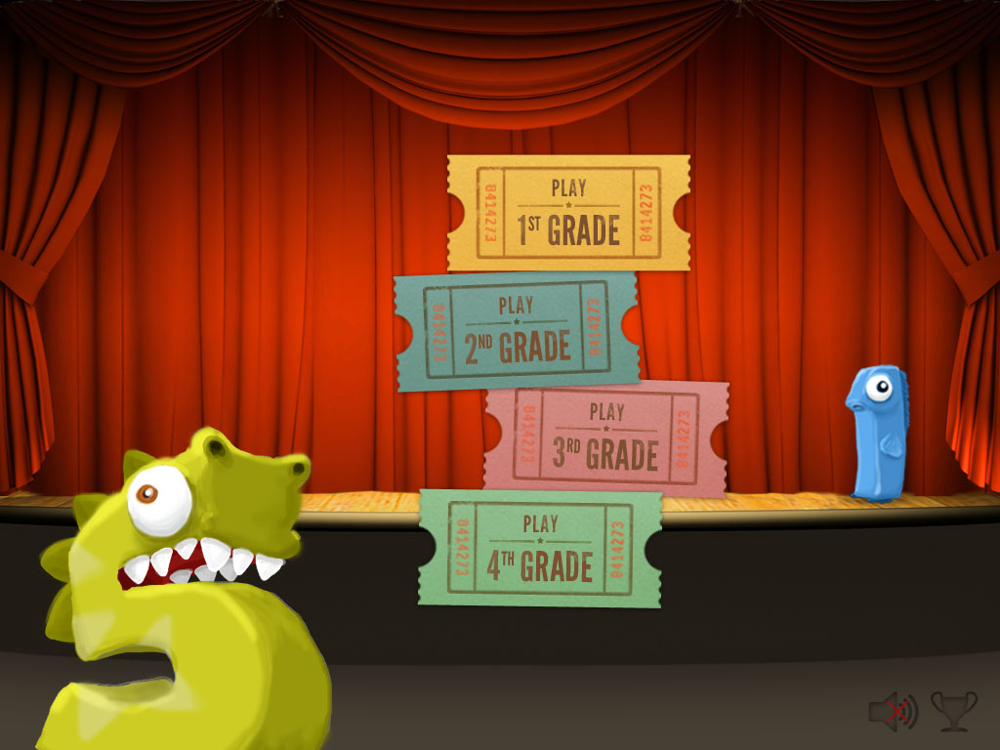
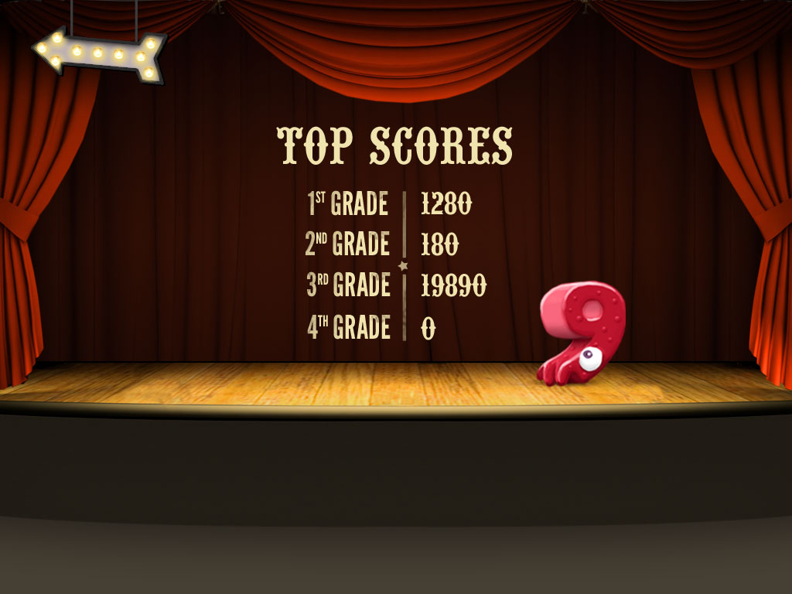

# Math Monsters for iPad

Download it for free from the [App Store](https://itunes.apple.com/us/app/math-monsters/id499455175?ls=1&mt=8) or play the [online version](http://aprendagames.com/games/math-monsters/flash-game/). 

## About The Game 
Math Monsters is an educational math game built in Unity with JavaScript. It has over 120,000 downloads on the App Store and is being used by schools across the country. The game is pretty simple, but the psychology behind the countdown timer is what makes it special. Each time you answer a question correctly, you get a little more time. This creates a building sense of urgency to be quick and accurate. I’ve seen kids squeal as the timer hangs around the 2 second mark and jump out of their seats when the time runs out. Tell me the last time you saw a kid get that excited about arithmetic. :) 

## Screenshots

## Installation

1. Install Unity 3D 
2. Download this entire repo and open one of the .Unity files

#### Required Plugins

1. [iTween](http://itween.pixelplacement.com/index.php)
2. [TK2D](https://www.assetstore.unity3d.com/en/#!/content/908)
